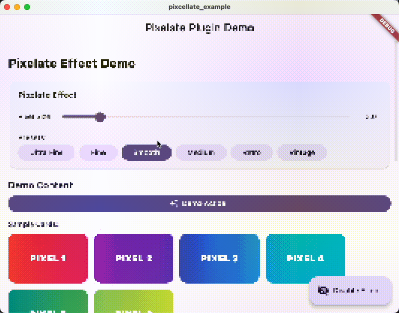

# flutter_pixelate


A simple Flutter plugin that provides retro pixel effects with customizable block size. Perfect for creating nostalgic gaming experiences reminiscent of classic arcade games.

## Live Demo

**[Try the interactive demo here!](https://kouheisatou.github.io/flutter_pixelate/)**

Experience the pixelation effects in your browser with real-time controls.

## Features




- **Real-time Pixelation**: Apply pixelation effects to any Flutter widget
- **Customizable Block Size**: Control the pixel size with a simple parameter
- **Performance Optimized**: Uses Fragment Shaders for 60fps smooth effects
- **Easy Integration**: Simple widget-based API
- **Preset Effects**: Built-in presets for different retro styles

## Visual Examples

Transform any Flutter UI into a retro gaming experience:

- **Ultra Fine** (blockSize: 0.5) - Ultra-detailed pixelation
- **Fine** (blockSize: 1.0) - Fine pixelation for subtle effects
- **Smooth** (blockSize: 3.0) - Subtle pixelation
- **Medium** (blockSize: 6.0) - Balanced retro feel
- **Retro** (blockSize: 12.0) - Classic gaming console look  
- **Vintage** (blockSize: 20.0) - Extreme pixelation for artistic effect

## Installation

Add this to your package's `pubspec.yaml` file:

```yaml
dependencies:
  flutter_pixelate:
    git:
      url: https://github.com/kouheisatou/flutter_pixelate.git
```

## Usage

### Basic Usage

Wrap any widget with `PixelateWidget`:

```dart
import 'package:flutter_pixelate/flutter_pixelate.dart';

PixelateWidget(
  blockSize: 6.0,
  child: YourWidget(),
)
```

### Using Effect Configurations

For more complex scenarios, use `PixelateContainer` with `PixelateEffect`:

```dart
PixelateContainer(
  effect: PixelateEffect.retro,
  child: YourWidget(),
)
```

### Custom Effect Configuration

```dart
const customEffect = PixelateEffect(
  blockSize: 8.0,
  enabled: true,
);

PixelateContainer(
  effect: customEffect,
  child: YourWidget(),
)
```

### Interactive Controls

Add user controls for real-time effect adjustment:

```dart
class MyPixelatedApp extends StatefulWidget {
  @override
  _MyPixelatedAppState createState() => _MyPixelatedAppState();
}

class _MyPixelatedAppState extends State<MyPixelatedApp> {
  PixelateEffect effect = PixelateEffect.medium;

  @override
  Widget build(BuildContext context) {
    return Scaffold(
      body: Column(
        children: [
          // Controls
          PixelateControls(
            effect: effect,
            onEffectChanged: (newEffect) {
              setState(() {
                effect = newEffect;
              });
            },
          ),
          
          // Your pixelated content
          Expanded(
            child: PixelateContainer(
              effect: effect,
              child: YourContent(),
            ),
          ),
        ],
      ),
    );
  }
}
```

## Requirements

- Flutter 3.3.0+
- Dart 3.8.1+
- `flutter_shaders` ^0.1.3

## Technical Details

This plugin uses Fragment Shaders from the `flutter_shaders` package to achieve high-performance real-time pixelation effects. The shader samples the widget tree as a texture and applies pixelation with optional grid overlay.

## Contributing

Contributions are welcome! Please feel free to submit a Pull Request.
